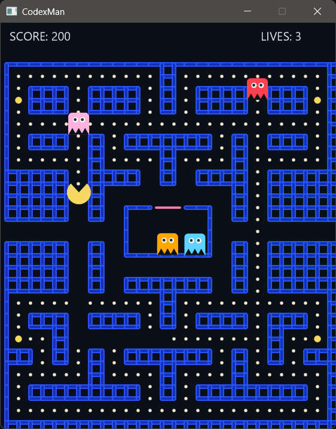

# Codexaga

Standalone JavaFX Galaga-inspired shooter built for JDK 25. This project was developed by GPT-5.2-Codex as an experiment and for fun. It's just a quick demo showing a classic arcade loop in a single prompt.



## Requirements

- JDK 25 (tested with JDK 25)
- Maven 3.9+
- JavaFX runtime (pulled automatically via Maven when running with the plugin)

## Build

```bash
mvn clean package
```

## Run

```bash
mvn javafx:run
```

If you use an IDE run button instead of Maven, make sure it passes the JavaFX module path and modules. The Maven plugin handles this for you.

## How to Play

Controls:
- Left/Right (or A/D): move
- Space/Z/X/Up: fire
- Enter: start
- R: restart
- P: pause

Features:
- Formation movement with descending waves
- Enemy fire and escalating difficulty
- Score, lives, and level tracking

## License

MIT. See `LICENSE`.
